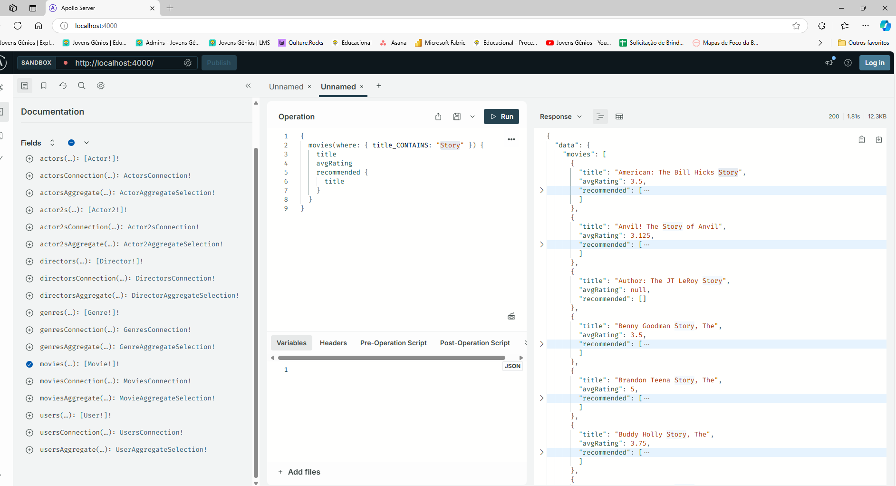

# Projeto Back-end sistema de recomendação de filmes

<p align="center">**Objetivo**: Criar uma API GraphQL para o sistema de recomendação de filmes </p>
<h1 align="center">
#  João Ferreira Neto Desenvolvedor  </h1>
<p align="center"></p>


<p align="center">
    <a href="README.md">Português</a>
 </p>

<div align="center">
  <sub>Construído por
    <a href="https://github.com/JG-JoaoFNeto">João Ferreira Neto</a> and
    <a href="https://github.com/JG-JoaoFNeto/Trilha-de-Aprendizado-GVAND-Stack/graphs/contributors">
      contributors
    </a>
  </sub>
</div>

## Habilidades desenvolvidas

Ao fim deste projeto você terá os seguintes superpoderes, você será capaz de:

- Compreender conceitos básicos do Neo4j e seus benefícios como banco de dados em grafos.
- Aplicar algoritmos de similaridade em grafos para recomendação.
- Criar APIs GraphQL com Neo4j como banco de dados, utlizando a biblioteca @neo4j/graphql, a base da GRAND Stack.


# :pushpin: Tabela de Conteúdo

* [Tecnologias](#computer-tecnologias)
* [Funcionalidades](#rocket-funcionalidades)
* [Como rodar](#construction_worker-como-rodar)

<h2 align="left"> 📥 Localhost:4000: </h2>

### Web Screenshot
<div style="display: flex; flex-direction: 'row'; align-items: 'center';">
   
</div> 

# :computer: Tecnologias
## Stack e requisitos técnicos

Para este projeto é recomendado que você já saiba os fundamentos do [Neo4j](https://neo4j.com/), você pode iniciar sua jornada utilizando o [Neo4j Sandbox de Movie Recommendation](https://neo4j.com/sandbox/). Assim como também é recomendado que você entenda os [fundamentos do GraphQL](https://graphql.org/learn/).

Neste projeto, você usará as seguintes tecnologias:

- Neo4j: como banco de dados em grafo para toda a aplicação.
- Apollo Server: ferramenta consistente para GraphQL no desenvolvimento do lado do servidor.
- @neo4j/graphql: biblioteca para facilitar a criação de APIs em GraphQL + Neo4j, a base para a GRAND stack.

# :rocket: Funcionalidades

- Nós disponíveis para CRUD: User, Director, Actor, Movie e Genre.
- CRUD de relacionamento entre User e Movie. Para salvar um rating que o usuário deu para determinado filme.
- Filmes similares a determinado filme, usando Content-Based Filtering.
- Recomendação de filmes para determinado usuário, usando Collaboritive Filtering.
- Implementar uma query com [full-text search](https://neo4j.com/docs/graphql-manual/current/type-definitions/indexes-and-constraints) e [fuzzy match](https://neo4j.com/labs/apoc/4.3/overview/apoc.text/apoc.text.fuzzyMatch) para encontrar filmes baseado na busca escrita do usuário.

# :construction_worker: Como rodar
Criar um arquivo .env e atribuir os valores das variáves conforme o sandBox apreendido nos curso Neo4j e GraphQL.
```bash
# Clone o Repositoria
$ git clone https://github.com/JG-JoaoFNeto/Trilha-de-Aprendizado-GVAND-Stack.git

### 💻 Rode o Project

```bash
# Vá para a pasta web
$ cd Trilha-de-Aprendizado-GVAND-Stack\soluction_JFN\back_end

# Instale as depedencias
$ npm install

# Rode a aplicação
$ npm start
```
Acesse: http://localhost:4000/ para ver o resultado.


<br/> :email: &nbsp; Entre em contato comigo: [](https://www.linkedin.com/in/joaoferreiraneto/)

#

